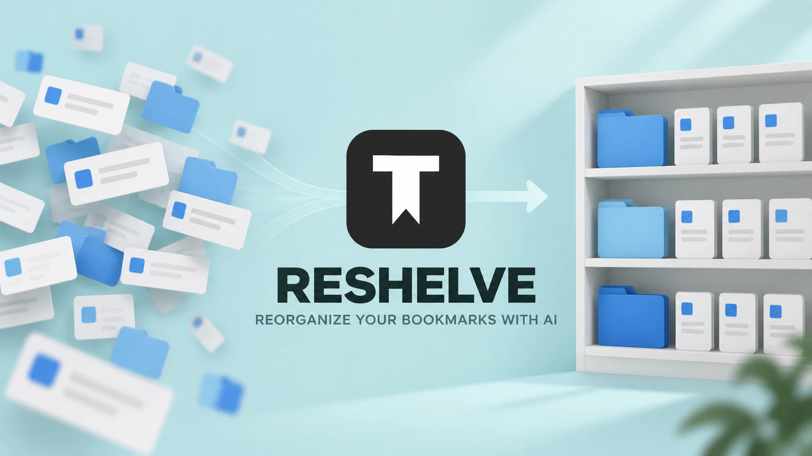
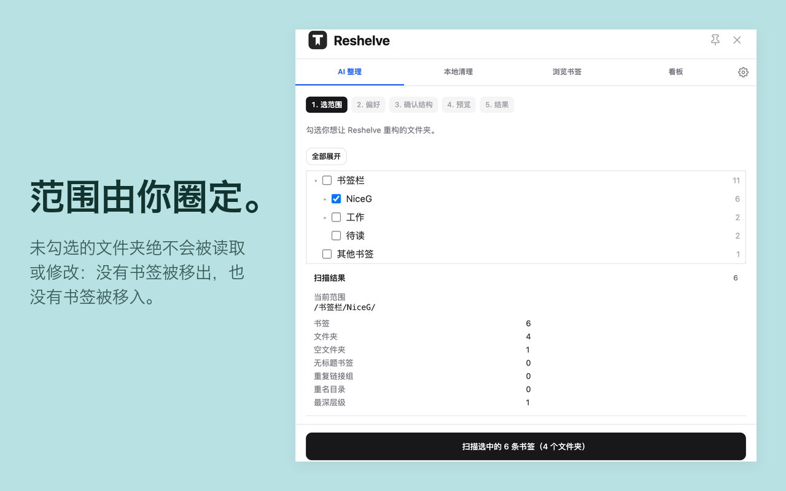
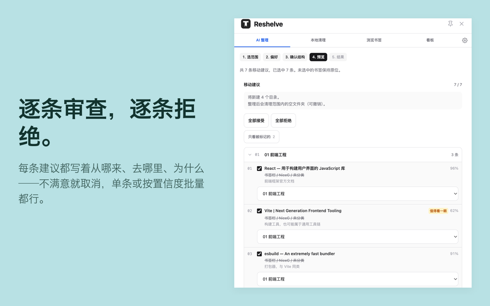
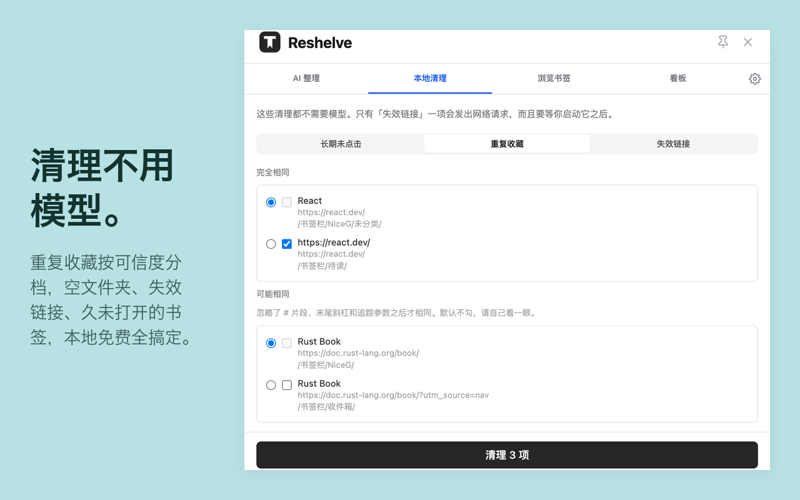
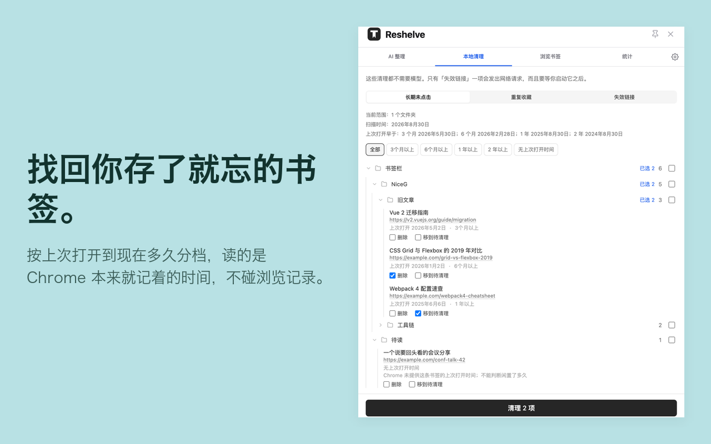
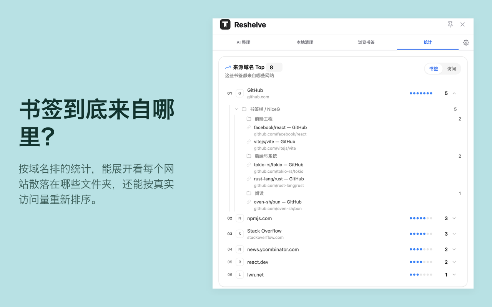

# Reshelve

用 AI 重新整理你的 Chrome 书签——每一处改动都会先预览、经你确认，并且随时可以撤销。

**[▸ 从 Chrome 应用商店安装](https://chromewebstore.google.com/detail/reshelve/hlmicephladojlmomimpngjaaaflapma)**

[English](README.md) | 简体中文

<p align="center">
  
</p>

Reshelve 整理的是你**原生的 Chrome 书签**，而不是另起炉灶的一套东西。整理完成后，书签栏还是那个书签栏，跨设备同步也和以前一样正常工作。

<p align="center">
  
</p>

<p align="center">
  
</p>


## 说了算的是你，不是 AI

<p align="center">
  
</p>

- **范围由你划定。** 勾选你想整理的文件夹。没勾选的文件夹既不会被读取，也不会被改动——不会有书签从里面搬走，也不会有书签搬进去。
- **这次走哪条路，由你拍板。** Reshelve 会看当前范围，建议把书签归进现有文件夹，或在确实一团乱麻时重新设计整棵目录树，并讲清楚理由。动手之前你可以推翻它：全部归入、只处理直接散落在根下的书签，或者推倒重来。
- **也可以不调用模型，只改标题。** 勾选你关心的平台（GitHub、GitLab、npm / PyPI / Docker Hub、Hugging Face、arXiv、YouTube、CSDN、知乎、掘金、Bilibili、Medium / Dev.to）。规则在本地按 URL 跑——不调用模型，也不去打开这些网页。每条改名都会先列出来给你确认。
- **每一次改动都可复核。** 在真正落地之前，所有移动和改名都会列出来：每个书签原本在哪、要去哪、为什么。你可以逐条取消，也可以按置信度批量筛选。
- **一键撤销。** 结果不满意？把一切恢复原样。

## 模型自备

Reshelve 没有服务器。你把它指向你自己的接口：

- OpenAI 官方 API
- 任何兼容 OpenAI 的服务（DeepSeek、Moonshot、智谱、OpenCode Go、OpenRouter、自建代理……）
- 本机上的 Ollama 或 LM Studio——数据不会离开你的电脑

其中 OpenCode Go 是面向 coding-agent 流量的网关，用它做书签分类是 best-effort 支持。如果测试连接反复失败，建议改用模型厂商（智谱、Kimi 等）的直连接口。

你填的每一把 API Key 都保存在本地的 `chrome.storage` 里，各自只会发往它对应的那个接口；在设置页删掉一个端点，那把 Key 一并消失。

## 隐私，说具体的

以下这些说法，与其信我，不如自己去核对：

| 说法 | 去哪儿核对 |
|---|---|
| URL 在发送前会被裁剪——查询参数、锚点和内嵌凭据都会被剥掉，只留下域名和路径 | [`src/core/sanitize.ts`](src/core/sanitize.ts) |
| 安装时不申请任何主机访问权限；运行时只申请你填写的那一个域名 | [`src/sidepanel/lib/permissions.ts`](src/sidepanel/lib/permissions.ts) |
| 对外流量只去你配置的那个接口（对话、拉取模型列表、连通性探测），以及——仅当你真的跑了失效链接检查时——向每条书签自己的站点发一次 HEAD（服务器不认 HEAD 时回退成 GET）。没有埋点、遥测或追踪 | [`src/llm/client.ts`](src/llm/client.ts)、[`src/llm/models.ts`](src/llm/models.ts)、[`src/engine/linkCheck.ts`](src/engine/linkCheck.ts) |

[`src/sidepanel/lib/favicons.ts`](src/sidepanel/lib/favicons.ts) 里也有一处 `fetch`，但不是对外请求：它读的是 `chrome-extension://<id>/_favicon/`，也就是 Chrome 自己的本地图标缓存，用来给 HTML 导出补上图标。没有任何东西离开你的机器。

`optional_host_permissions` 里之所以有通配符，是两件事叠在一起：接口地址由你自己选，没法提前一一列举；失效链接检查又得够得着你书签指向的任何站点。两者都是*可选*权限，安装时一个都不会被授予。端点那条，`chrome.permissions.request()` 每次只申请你填的那一个域名；「访问所有网站」那条只在你按下失效链接检查的按钮时才申请，在那之前永远不会。

完整政策：[Privacy Policy / 隐私权政策](https://gist.github.com/gaotiesuanna/239c067efd9cc7d98f25ed5daa4c3ef7)

## 还附带这些

- **本地清理**，不调用模型。去重、检查失效链接、按 Chrome 记录的上次打开时间找出长期未访问的书签（不读浏览记录），或按标题/网址里的指定文字聚合。只有失效链接检查会联网，而且只在你按下按钮之后。
- **导出**所选文件夹为 JSON——保留完整的文件夹结构，或者导出成扁平的链接列表——也可以导出成别的浏览器能导入的 Netscape HTML 书签文件。
- **导入**别人分享给你的书签文件。写入之前你会先看到里面有什么，而且所有内容都会落到一个新建的文件夹里。`javascript:` 和 `data:` 链接会被拦截并明确告知，而不是悄悄丢掉。
- **统计**按域名排行你的收藏来源。按访问次数排行是可选的，而且只有你按下那个按钮时才会申请浏览记录权限。

<p align="center">
  
</p>

<p align="center">
  
</p>

<p align="center">
  
</p>


## 从源码构建

上面的应用商店是省事的路子。如果你想读一读自己正在运行的代码，或者想动手改，就自己构建：

```bash
npm install
npm run build     # 先类型检查，再构建到 dist/
npm test          # 1900+ 个单元测试，不联网
npm run dev       # 带 HMR 的开发服务器
```

在 `chrome://extensions` 里选 *加载已解压的扩展程序*，指向 `dist/` 即可加载。

manifest 是构建时由 CRXJS 从 [`manifest.config.ts`](manifest.config.ts) 生成的——别手写 `dist/manifest.json`，它会被覆盖掉。

## 目录结构

| 路径 | 放的是什么 |
|---|---|
| `src/core` | 纯逻辑：URL 清洗、标题规则、文件夹树构建。不碰浏览器 API |
| `src/engine` | 把方案转成书签操作，以及撤销快照 |
| `src/llm` | 模型客户端和提示词 |
| `src/storage` | 设置、缓存、撤销快照 |
| `src/background` | Service Worker |
| `src/sidepanel` | 全部界面 |
| `src/i18n` | 文案查找；字符串放在 `public/_locales` |

## 许可协议

[Apache-2.0](LICENSE)
